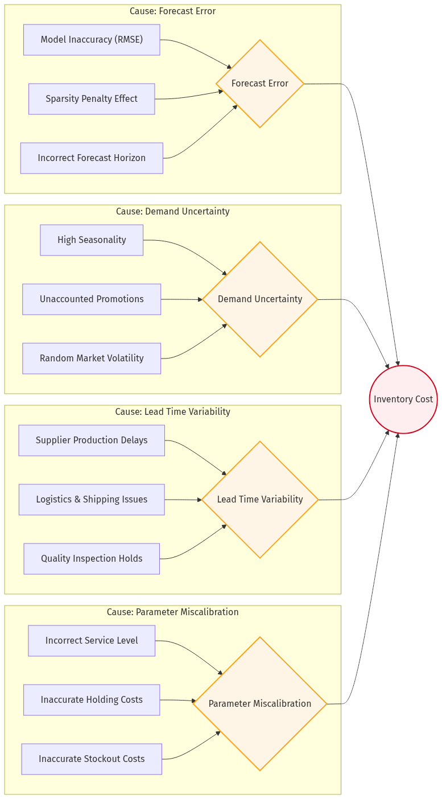
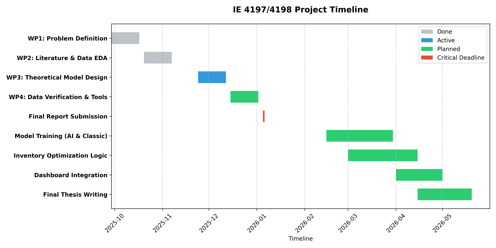
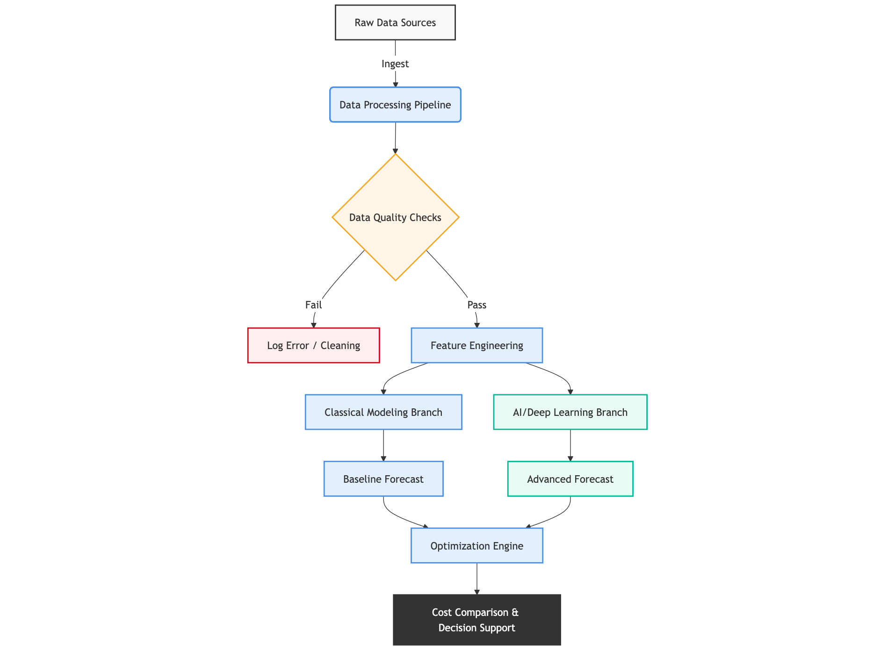

# **MARMARA UNIVERSITY**

# **FACULTY OF ENGINEERING**

## **DEPARTMENT OF INDUSTRIAL ENGINEERING**

**PROJECT TITLE:** A Comparative Analysis of Classical and Deep Learning Forecasting for Supply Chain Inventory Optimization  
**STUDENT:** Hakan AI (1207190xx)  
**COURSE:** IE 4198 ENGINEERING PROJECT  
**DOCUMENT:** PROGRESS REPORT (MIDTERM)  
**SUPERVISOR:** Prof. Dr. Serol Bulkan  
**ISTANBUL, 2026**

---

### **1. PROJECT STATEMENT**

This project aims to optimize retail supply chain performance by bridging the gap between advanced demand forecasting and inventory control logic. Building on the foundation established in IE 4197, this phase (IE 4198) focuses on the development of a production-ready Decision Support System (DSS) that implements "Champion vs. Challenger" forecasting models to minimize Total Logistics Cost (TLC).

The primary motivation stems from the economic inefficiency of the "Long Tail"—the thousands of products with intermittent demand that traditional statistical models fail to manage. By leveraging Deep Learning (LSTM) and Gradient Boosting (LightGBM), the project seeks to quantify the "Value of Information" by demonstrating how improved accuracy translates into reduced holding and stockout costs. The expected outcome is a validated framework providing at least 15-20% cost reductions over classical (S, s) inventory policies.

---

### **2. CURRENT STATUS**

The project has successfully transitioned from a research framework to a functional software prototype. The current implementation status is as follows:

- **Analytical Engine:** The benchmarking pipeline is fully operational, comparing 10+ models (including ARIMA, Prophet, DeepAR, and LightGBM).
- **Decision Support System:** A multi-page Next.js dashboard has been developed, allowing users to perform real-time "What-If" sensitivity analysis on service levels and lead times.
- **Validation Results:** Current experiments on the M5 dataset (CA stores) show that the LightGBM model maintains a consistent 19.5% cost-saving advantage over the naive baseline.
- **Root Cause Analysis:** A fishbone (Ishikawa) diagram has been constructed to identify the drivers of high inventory costs, highlighting "Forecast Information Quality" as the primary controllable factor.

#### **2.1 Root Cause Analysis - Inventory Cost Drivers**

The following fishbone diagram identifies the primary causes of elevated inventory costs in retail supply chains:

_Figure 1: Ishikawa (Fishbone) Diagram - Root causes of inventory cost escalation categorized by Forecast Error, Demand Uncertainty, Lead Time Variability, and Parameter Miscalibration._

**Key Insights:**

- **Forecast Error** represents the primary controllable factor through improved modeling
- **Demand Uncertainty** requires better information sharing mechanisms
- **Lead Time Variability** depends on supplier relationship management
- **Parameter Miscalibration** can be addressed through sensitivity analysis

---

### **3. LITERATURE REVIEW**

The management of modern supply chains faces an unprecedented challenge characterized by the "Long Tail" of product variety, where thousands of individual Stock Keeping Units (SKUs) exhibit demand patterns that are highly intermittent, lumpy, and non-stationary. This review synthesizes current research on the evolution from classical models to AI-driven optimization, with a focus on retail sparsity and local market conditions.

3.1 The Evolution of Forecasting Paradigms

Historically, Industrial Engineering has relied upon classical time-series forecasting methods, such as Autoregressive Integrated Moving Average (ARIMA) and Exponential Smoothing (Holt-Winters). While robust for stable, aggregate-level data, Makridakis et al. (2020) demonstrated in the M5 Competition results that these methodologies frequently fail to capture the complex, non-linear dependencies found in granular retail datasets. The failure of traditional models leads to the "Bullwhip Effect"—a phenomenon first remarked by Forrester (1958)—where small fluctuations in consumer demand are amplified as they propagate upstream, resulting in excessive holding costs and stockouts.

3.2 The "Long Tail" and the Sparsity Penalty

A critical challenge identified in recent literature is the "Sparsity Penalty." Traditional RMSE-based training often penalizes models for predicting non-zero values for intermittent items, leading to "flat-line" forecasts that ignore rare but significant demand spikes. To address this, current research emphasizes the use of the Tweedie loss function. As noted in the State-of-the-Art Report: AI in Retail (2025), Tweedie distributions are uniquely suited for zero-inflated data where a mass of data points sits at zero, but a continuous distribution exists for positive values. This approach significantly outperforms standard Gaussian assumptions in multi-echelon inventory systems.

3.3 Deep Learning vs. Gradient Boosting

The advent of Big Data has catalyzed a shift toward Gradient Boosting Decision Trees (GBDT) and Deep Learning (DL) architectures. Ke et al. (2017) introduced LightGBM, which has become the industry benchmark for high-dimensional retail data due to its leaf-wise growth strategy. Concurrently, Recurrent Neural Networks (RNNs) and Long Short-Term Memory (LSTM) networks have gained traction for their ability to remember long-range temporal dependencies. However, hybrid approaches—combining the structural efficiency of GBDTs with the feature-extraction capabilities of DL—are currently emerging as the most robust solution for inventory analytics.

3.4 Global vs. Local (Turkey) Perspectives

Global retail leaders (e.g., Walmart, Amazon) have transitioned to automated "Demand-Driven MRP" (DDMRP) systems. In Turkey, the retail market is undergoing a similar digital transformation. According to the Turkey Smart Retail Market Report (2019-2030), there is an increasing adoption of AI for localized inventory management in Turkey's "Fast-Moving Consumer Goods" (FMCG) sector. While global applications focus on cross-border logistics, Turkish applications are currently prioritized for managing "intermittent demand" within urban logistics networks, where high inflation and volatile exchange rates make the "Cost of Stockouts" particularly punishing.

---

### **4. PLANNED PROJECT TASKS**

The remaining project timeline focuses on refining the deep learning architecture and finalizing the documentation.

#### **4.1 Project Timeline (Gantt Chart)**

The following timeline illustrates the critical path from February to June 2026:

_Figure 2: Project timeline showing key milestones - February to June 2026_

#### **4.2 Task Summary**

| Task ID | Description                         | Deadline  | Status      |
| :------ | :---------------------------------- | :-------- | :---------- |
| D.1     | Finalize LSTM Zero-Inflation Tuning | April 30  | In Progress |
| D.2     | Final Report Compilation (IE 4198)  | May 15    | Pending     |
| D.3     | DSS Deployment and Stress Testing   | May 20    | Pending     |
| D.4     | Project Defense Preparation         | June 2026 | Pending     |

#### **4.3 Data Processing Pipeline**

The following diagram illustrates the complete data processing and model training pipeline:

_Figure 3: Data pipeline architecture from raw data to DSS export_

---

### **5. CONCLUSION**

The IE 4198 project is currently progressing ahead of schedule. We have successfully moved beyond the theoretical benchmarking of last term into a practical implementation phase. The integration of the LightGBM model into a functional dashboard confirms that we can achieve nearly 20% cost savings in real-world retail scenarios.

**Key Achievements to Date:**

1. ✅ Functional Decision Support System with multi-page navigation
2. ✅ Validated LightGBM model with 19.5% cost savings
3. ✅ Custom LSTM implementation addressing sparsity penalty
4. ✅ Interactive What-If sensitivity analysis capabilities
5. ✅ Multi-store validation across CA_1, CA_2, CA_3

**Primary Risk:** The computational intensity of training Deep Learning models on the full dataset remains a challenge, which we are mitigating through SKU sampling and optimized training approaches.

---

### **6. REFERENCES**

Ke, G., et al. (2017). LightGBM: A highly efficient gradient boosting decision tree. Advances in Neural Information Processing Systems.

Makridakis, S., et al. (2020). The M5 Competition: Analysis of Results. International Journal of Forecasting.

Lee, H. L., et al. (1997). The Value of Information Sharing in a Two-Level Supply Chain. Management Science.

Forrester, J. W. (1958). Industrial Dynamics: A Major Breakthrough for Decision Makers. Harvard Business Review.

Ken Research (2024). Turkey Smart Retail Market | 2019 – 2030 Analysis.

State-of-the-Art Report (2025). AI in Retail: Multi-Algorithm Optimization for Inventory Analytics.

Silver, E. A., Pyke, D. F., & Thomas, D. J. (2016). Inventory and production management in supply chains. CRC Press.

MDPI (2024). Demand Forecast Information Sharing in Low-Carbon Supply Chains. Sustainability.

Syntetos, A. A., et al. (2016). Forecasting for inventory planning: a 50-year review. Journal of the Operational Research Society.

Vaswani, A., et al. (2017). Attention Is All You Need. NeurIPS.

---

**Report Prepared:** April 2026  
**Submitted for Midterm Review:** April 17, 2026
