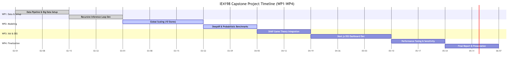

<div align="center">
  
</div>

**MARMARA UNIVERSITY**
**FACULTY OF ENGINEERING**

**A COMPARATIVE ANALYSIS OF CLASSICAL AND DEEP LEARNING FORECASTING FOR SUPPLY CHAIN INVENTORY OPTIMIZATION**

150322052 \- Hakan İspir
150320024 \- Boran Turan
150320052 \- Ali Kahya

**IE 4198 ENGINEERING PROJECT**
**FINAL REPORT**

Department of Industrial Engineering

**Supervisor**
Prof. Dr. Serol BULKAN

ISTANBUL, 2026

<div style="page-break-before: always;"></div>

# **ACKNOWLEDGEMENTS**

We would like to sincerely thank our supervisor, Prof. Dr. Serol Bulkan,for his valuable guidance, ongoing support, and expert knowledge ofOptimization Theory during this project. His mentorship helped set the direction for this study and provided guidance on how to approach the design of the inventory policy. We also thank the Marmara University Industrial Engineering Department for providing us with the academic background required to conduct such a detailed study. We would like to thank the open-source community and the Makridakis Open Forecasting Center (MOFC) for providing the M5 Forecasting Dataset, which was essential to our research.

**January, 2026	 	Hakan İspir, Boran Turan, Ali Kahya**

<div style="page-break-before: always;"></div>

# **TABLE OF CONTENTS**

[ACKNOWLEDGEMENTS	2](#acknowledgements)

[TABLE OF CONTENTS	3](#table-of-contents)

[**ABSTRACT	4**](#heading=)

[**ÖZET	5**](#heading=)

[**LIST OF SYMBOLS	7**](#list-of-symbols)

[**ABBREVIATIONS	8**](#abbreviations)

[LIST OF FIGURES	9](#list-of-figures)

[LIST OF TABLES	10](#list-of-tables)

[**WORK PLAN	11**](#heading=)

[**1\. INTRODUCTION	15**](#introduction)

[1.1. Project Content	17](#1.1.-project-content)

[**2\. RESEARCH OBJECTIVE	19**](#research-objective)

[**3\. RELATED LITERATURE	20**](#3.-related-literature)

[3.1. Deep Learning &amp; Time Series (AI Focus)	20](#3.1.-deep-learning-&-time-series-\(ai-focus\))

[3.2. Inventory Optimization &amp; Supply Chain (IE Focus)	20](#3.2.-inventory-optimization-&-supply-chain-\(ie-focus\))

[3.3. Classical Forecasting &amp; Retail Baselines	21](#3.3.-classical-forecasting-&-retail-baselines)

[3.4. Explainable AI (XAI) and Decision Support Systems (DSS)	21](#3.4.-explainable-ai-(xai)-and-decision-support-systems-(dss))

[**4\. METHODOLOGY	22**](#4.-methodology)

[4.1. Data Description	22](#4.1.-data-description)

[4.2. Forecasting Models	24](#4.2.-forecasting-models)

[4.2.1. Classical Statistical Baselines (Univariate)	24](#4.2.1.-classical-statistical-baselines-\(univariate\))

[4.2.2. Machine Learning Ensembles (Tree-Based)	25](#4.2.2.-machine-learning-ensembles-\(tree-based\))

[4.2.3. Deep Learning Architectures	26](#4.2.3.-deep-learning-architectures)

[4.3. Data Processing Framework (Big Data Strategy)	27](#4.3.-data-processing-framework-\(big-data-strategy\))

[**5\. APPLICATION AND RESULTS	30**](#5.-application-and-results)

[5.1. Comparative Analysis of Forecast Accuracy	30](#5.1.-comparative-analysis-of-forecast-accuracy)

[5.1.1. Benchmark Scope and Algorithm Selection	30](#5.1.1.-benchmark-scope-and-algorithm-selection)

[5.1.2. The Sparsity Penalty and Intermittent Demand	33](#5.1.2.-the-sparsity-penalty-and-intermittent-demand)

[5.2. Financial Impact and Operational Performance	33](#5.2.-financial-impact-and-operational-performance)

[5.2.1. Cost Trade-offs and Safety Stock Optimization	34](#5.2.1.-cost-trade-offs-and-safety-stock-optimization)

[5.3. Model Explainability Analysis	36](#5.3.-model-explainability-analysis)

[5.4. Dynamic Sensitivity Analysis &amp; Economics	37](#5.4.-dynamic-sensitivity-analysis-&-economics)

[5.5. Impact of Recursive Inference: A Before &amp; After Analysis	38](#5.5.-impact-of-recursive-inference:-a-before-&-after-analysis)

[**ENGINEERING DESIGN EXPERIENCE	39**](#engineering-design-experience)

[**6\. CONCLUSION	40**](#6.-conclusion)

[**REFERENCES	37**](#references)

[**APPENDICES	39**](#appendices)

[Appendix A: Key Algorithm Logic	39](#appendix-a:-key-algorithm-logic)

[A.1 Classical Models (Holt-Winters Implementation)	39](#a.1-classical-models-\(holt-winters-implementation\))

[A.2 Optimization Cost Function	39](#a.2-optimization-cost-function)

[Appendix B: Simulation Parameters	40](#appendix-b:-simulation-parameters)

[Appendix C: Master Algorithm Pseudocode	40](#appendix-c:-master-algorithm-pseudocode)

[Appendix D: Next.js Decision Support System Architecture	41](#appendix-d:-next.js-decision-support-system-architecture)

<div style="page-break-before: always;"></div>

# **ABSTRACT**

**A Comparative Analysis of Classical and Deep Learning Forecasting for Supply Chain Inventory Optimization**

Inaccurate retail demand forecasting causes upstream supply chain distortions known as the Bullwhip Effect, leading to excess holding and stockout costs. Traditional mathematical models severely struggle when handling zero-inflated, intermittent demand. To address this, this study evaluates classical baseline models (ARIMA, Holt-Winters), machine learning ensembles (LightGBM), and deep learning architectures (LSTM) using a massive 59-million-row Walmart retail dataset.

Two parallel methodologies were employed: layered statistical sampling of key items and high-performance big data computing via Python and Polars. Forecasts generated by ten different algorithms were subsequently fed into a stochastic (Q, r) inventory simulation to mathematically derive the Total Logistics Cost (TLC) of the supply chain.

Results demonstrated that LightGBM significantly outperformed both classical baselines and complex LSTM networks. While LSTM effectively minimized mathematical logarithmic errors, it practically failed by forecasting small nonzero sales during inactive periods, which artificially inflated storage costs. Conversely, LightGBM reduced total logistics spending by nearly 20% compared to standard practice, translating to approximately $125,000 in simulated annual savings. These optimized models were operationalized within a Next.js Decision Support System (DSS), enabling real-time Newsvendor parameter optimization and SHAP-based game-theory explainability. Ultimately, gradient-boosted trees proved vastly superior to recurrent networks for aligning forecast precision directly with economic utility in highly intermittent demand environments.

**Key words: Supply Chain Forecasting, Inventory Optimization, Deep Learning, LightGBM, M5 Dataset.**

<div style="page-break-before: always;"></div>

# **ÖZET**

**Tedarik Zinciri Envanter Optimizasyonu için Klasik ve Derin Öğrenme Tahminleme Yöntemlerinin Karşılaştırmalı Analizi**

Hatalı perakende talep tahminleri, tedarik zincirinde Kamçı Etkisi (Bullwhip Effect) olarak bilinen sapmalara yol açarak aşırı stok tutma ve yok-satma maliyetlerine neden olur. Geleneksel modeller, özellikle aralıklı (intermittent) ve sıfır-enflasyonlu taleplerde yetersiz kalmaktadır. Bu çalışmada, 59 milyon satırlık Walmart veri seti kullanılarak klasik (ARIMA, Holt-Winters), makine öğrenmesi (LightGBM) ve derin öğrenme (LSTM) tahmin modelleri karşılaştırmalı olarak değerlendirilmiştir.

İki paralel metodoloji uygulanmıştır: standart istatistiksel örneklem analizi ve Python/Polars kütüphaneleriyle yüksek performanslı büyük veri hesaplaması. On farklı algoritmanın ürettiği tahminler, (Q, r) stokastik envanter simülasyonuna entegre edilerek Toplam Lojistik Maliyetleri (TLC) hesaplanmıştır.

Sonuçlar, LightGBM'in hem Naive (saf) modelleri hem de LSTM'i geride bıraktığını göstermiştir. LSTM, matematiksel logaritmik hataları minimize etse de, satışın olmadığı ölü dönemlerde sıfırdan farklı küçük değerler tahmin ederek depolama masraflarını pratik olarak artırmıştır. Buna karşın LightGBM, standart uygulamalara kıyasla lojistik harcamalarını yaklaşık %20 oranında azaltmış ve simülasyon şartlarında yıllık 125.000$ tasarruf sağlamıştır. Optimize edilen bu modeller, yöneticilerin anlık duyarlılık analizleri yapabilmesini sağlayan ve SHAP tabanlı oyun teorisiyle açıklanabilirlik sunan Next.js tabanlı bir Karar Destek Sistemine (DSS) entegre edilmiştir. Sonuç olarak, aralıklı talep yapılarında gradyan artırımlı ağaçların (LightGBM), tahmin hassasiyetini ekonomik çıktılarla uyumlu hale getirmede yinelemeli sinir ağlarından (LSTM) çok daha üstün olduğu kanıtlanmıştır.

**Anahtar kelimeler:** Tedarik Zinciri Tahminleme, Envanter Optimizasyonu, Derin Öğrenme, LightGBM, M5 Veri Seti.

<div style="page-break-before: always;"></div>

# **LIST OF SYMBOLS**

| Symbol | Description                               |
| :----- | :---------------------------------------- |
| L      | Lead Time (days)                          |
| n      | Number of observations                    |
| Q      | Order Quantity                            |
| r      | Reorder Point                             |
| RMSE   | Root Mean Squared Error                   |
| SS     | Safety Stock                              |
| t      | Time period index                         |
| TC     | Total Logistics Cost                      |
| yt     | Actual demand at time t                   |
| ŷt     | Forecasted demand at time t               |
| Z      | Standard Normal Z-score for service level |
| SL     | Target Service Level (e.g., 95%)          |
| σ_e    | Standard deviation of forecast error      |

<div style="page-break-before: always;"></div>

# **ABBREVIATIONS**

| Abbreviation     | Definition                               |
| :--------------- | :--------------------------------------- |
| **AI**     | Artificial Intelligence                  |
| **ARIMA**  | Autoregressive Integrated Moving Average |
| **EDA**    | Exploratory Data Analysis                |
| **GBDT**   | Gradient Boosting Decision Trees         |
| **IE**     | Industrial Engineering                   |
| **LGBM**   | Light Gradient Boosting Machine          |
| **LSTM**   | Long Short-Term Memory (Neural Network)  |
| **MAE**    | Mean Absolute Error                      |
| **ML**     | Machine Learning                         |
| **RNN**    | Recurrent Neural Network                 |
| **SKU**    | Stock Keeping Unit                       |
| **SQL**    | Structured Query Language                |
| **RMSE**   | Root Mean Squared Error                  |
| **WRMSSE** | Weighted Root Mean Squared Scaled Error  |
| **TLC**    | Total Logistics Cost                     |

<div style="page-break-before: always;"></div>

# **LIST OF FIGURES**

Figure 1.1. Cause-and-effect (Fishbone) diagram illustrating the root causes of excess inventory costs, highlighting Forecast Error as a primary driver…………………………………………………15
Figure 1.2. Project timeline and Gantt chart illustrating the four primary work packages (WP1-WP4). ……………………………………………………………………………………………………16
Figure 3.1. Global sales trend of the M5 dataset (2011-2016) exhibiting clear annual seasonality, a pattern that classical decomposition methods attempt to isolate. ………………………………19
Figure 4.1. The proposed "Dual-Track" forecasting pipeline integrating Polars for feature engineering and PyTorch/LightGBM for prediction. …………………………………………………………20
Figure 4.2. Aggregate sales volume distribution across the 10 distinct stores in California (CA), Texas (TX), and Wisconsin (WI). ………………………………………………………………………21
Figure 4.3. Histogram analysis showing the high degree of sparsity (zero-inflated demand) in the retail dataset. …………………………………………………………………………………………...21
Figure 4.4. Daily sales trajectory for item FOODS\_3\_090, illustrating high intermittency and zero-inflation characteristics. …………………………………………………………………….22
Figure 4.5: High-Performance Data Processing Pipeline utilizing Polars for 59M row ingestion. …...25
Figure 5.1. Model performance leaderboard (RMSE) comparing Classical, ML, and Deep Learning approaches. ………………………………………………………………………………………27
Figure 5.2. Impact of data sparsity on forecast error; Deep Learning performance degrades as the percentage of zero-sales increases (The "Sparsity Penalty"). ……………………………………29
Figure 5.3. Comparative financial analysis showing the reduction in Total Logistics Cost achieved by the AI models. ……………………………………………………………………………………30
Figure 5.4. SHAP Feature Importance summary plot detailing predictive drivers. ……………………31
Figure 5.5. The Interactive Decision Support System dashboard illustrating Newsvendor sensitivity. …32

<div style="page-break-before: always;"></div>

# **LIST OF TABLES**

Table 4.1. A list of categories, algorithms and their characteristics. ………………………………….23
Table 5.1. Detailed performance metrics (RMSE, WRMSSE) across the tested algorithms. ………...27
Table 5.2: Inventory Optimization Simulation Results ……………………………………………….29

<div style="page-break-before: always;"></div>

# **WORK PLAN**

### **IE 4197 Work Plan**

| Wp           | Name of Wp                                 | Responsible                 | w1 | w2 | w3 | w4 | w5 | w6 | w7 | w8 | w9 | w10 | w11 | w12 | w13 | w14 |
| :----------- | :----------------------------------------- | :-------------------------- | :- | :- | :- | :- | :- | :- | :- | :- | :- | :-- | :-- | :-- | :-- | :-- |
| **1.** | **Defining the Problem**             | **All Group Members** | X  | X  | X  |    |    |    |    |    |    |     |     |     |     |     |
| 1.1          | Analyze Bullwhip & Cost Balance            | All Group Members           | X  | X  |    |    |    |    |    |    |    |     |     |     |     |     |
| 1.2          | Problem Statement & Diagram                | All Group Members           |    | X  | X  |    |    |    |    |    |    |     |     |     |     |     |
| **2.** | **Literature Review & Examination**  | **All Group Members** |    |    |    | X  | X  | X  | X  |    |    |     |     |     |     |     |
| 2.1          | ML Literature Review                       | Hakan İspir                |    |    |    | X  | X  | X  |    |    |    |     |     |     |     |     |
| 2.2          | Classical Literature & Standard            | Ali K., Boran T.            |    |    |    |    | X  | X  | X  |    |    |     |     |     |     |     |
| **3.** | **Method Identification & Modeling** | **Ali K., Boran T.**  |    |    |    |    |    |    |    |    | X  | X   | X   |     |     |     |
| 3.1          | Dual-Track Architecture                    | Ali Kahya                   |    |    |    |    |    |    |    |    | X  | X   |     |     |     |     |
| 3.2          | Mathematical Modeling                      | Boran Turan                 |    |    |    |    |    |    |    |    |    | X   | X   |     |     |     |
| **4.** | **Validating Data & Tools**          | **All Group Members**      |    |    |    |    |    |    |    |    |    |     |     | X   | X   | X   |
| 4.1          | EDA & Data Setup                           | Hakan İ., Ali K.           |    |    |    |    |    |    |    |    |    |     |     | X   | X   |     |
| 4.2          | Project Repository & Plan                  | Hakan İ., Boran T.         |    |    |    |    |    |    |    |    |    |     |     |     | X   | X   |

<br>

### **IE 4198 Work Plan**

| Wp           | Name of Wp                                 | Responsible                   | w1 | w2 | w3 | w4 | w5 | w6 | w7 | w8 | w9 | w10 | w11 | w12 | w13 | w14 |
| :----------- | :----------------------------------------- | :---------------------------- | :- | :- | :- | :- | :- | :- | :- | :- | :- | :-- | :-- | :-- | :-- | :-- |
| **5.** | **Global Scaling & ETL**             | **Hakan İ., Boran T.** | X  | X  | X  |    |    |    |    |    |    |     |     |     |     |     |
| 5.1          | Polars Pipeline Translation                | Hakan İspir                  | X  | X  |    |    |    |    |    |    |    |     |     |     |     |     |
| 5.2          | Full Dataset Ingestion                     | Boran Turan                   |    | X  | X  |    |    |    |    |    |    |     |     |     |     |     |
| **6.** | **Advanced Model Development**       | **Hakan İspir**        |    |    |    | X  | X  | X  | X  |    |    |     |     |     |     |     |
| 6.1          | Feature Engineering & LightGBM             | Hakan İspir                  |    |    |    | X  | X  | X  |    |    |    |     |     |     |     |     |
| 6.2          | DeepAR Architecture                        | Hakan İspir                  |    |    |    |    | X  | X  | X  |    |    |     |     |     |     |     |
| **7.** | **DSS & Economics Simulation**       | **All Group Members**        |    |    |    |    |    |    |    | X  | X  | X   | X   |     |     |     |
| 7.1          | DSS & Critical Ratio Optimizer             | All Group Members             |    |    |    |    |    |    |    | X  | X  | X   |     |     |     |     |
| 7.2          | SHAP & Financial Simulation                | All Group Members             |    |    |    |    |    |    |    |    | X  | X   | X   |     |     |     |
| **8.** | **Final Evaluation & Documentation** | **All Group Members**   |    |    |    |    |    |    |    |    |    |     |     | X   | X   | X   |
| 8.1          | Data Synthesis & Conclusion                | All Group Members             |    |    |    |    |    |    |    |    |    |     |     | X   | X   |     |
| 8.2          | Final Report & Defense                     | All Group Members             |    |    |    |    |    |    |    |    |    |     |     |     | X   | X   |

<br>

## **Phase 1: IE4197 (Fall Semester - Project Proposal & Research)**

**Duration**: 1 – 3 weeks
**Work Package 1:** Defining the Problem
**Activities:**

* Looking into the Bullwhip Effect within today’s retail supply networks reveals how flawed predictions often lead to too much stock. One major cause behind surplus inventory turns out to be unreliable demand forecasts.
* Started by outlining what the M5 Forecasting Challenge covered, particularly how balancing leftover stock expenses shaped decisions instead of running out too often. Costs tied to excess storage played off against those linked to missing sales. This balance guided the entire approach taken throughout the study.
* Early discussions took place with the project supervisor, Professor Doctor Serol Bulkan, ensuring research goals matched academic expectations. Starting these conversations helped clarify direction early on.
* A first version of the Problem Definition took shape through early structuring. Following that step, a Fishbone diagram emerged to trace possible causes.

**Deliveries of WP1:** Project Proposal Form, Problem Statement, Fishbone Diagram.
**Work package responsibility:** All group members

**Duration**: 4 – 7 weeks
**Work Package 2:** Literature Review & Examination of the Application
**Activities:**

* A thorough analysis of scholarly work on traditional prediction methods - such as Box-Jenkins and ARIMA - was carried out alongside newer techniques like Deep Learning and LSTM.
* Looking into the outcomes of the initial M5 Competition (Makridakis et al., 2022) [9], insight emerged about current benchmark standards.
* Looked into how sparse demand patterns appear in retail datasets, then examined effects on standard accuracy measures such as RMSE.
* Looking into common inventory methods, particularly the (Q, r) approach used in continuous monitoring.

**Deliveries of WP2:** Literature Review Chapter, List of Selected Algorithms (e.g. ARIMA, LightGBM, LSTM).
**Work package responsibility:** Boran Turan (ML Literature), Hakan İspir (Classical Literature).

**Duration**: 9 – 11 weeks
**Work Package 3:** Method Identification & Conceptual Modeling
**Activities:**

* A new structure called "Dual-Track" was built so that traditional models could operate at the same time as machine learning ones.
* Established a mathematical link connecting Forecast Error, measured by RMSE, to Safety Stock using the expression SS equals Z times the square root of L.
* For measuring accuracy, RMSE was chosen; regarding operational results, Total Logistics Cost served as the key indicator.
* A diagram took shape through Mermaid.js, forming a conceptual model.

**Deliveries of WP3:** System Architecture Diagram, Mathematical Model for Safety Stock.
**Work package responsibility:** Ali Kahya (System Design), Boran Turan (Mathematical Modeling).

**Duration**: 12 – 14 weeks
**Work Package 4:** Validating Data & Identifying Tools
**Activities:**

* Fresh off the platform, the M5 Dataset arrived intact - checked down to its 58 million entries.
* Started by installing Python, then add Polars to handle data efficiently. Next comes PyTorch - use it for building models later on.
* Starting with a look at the data, patterns in sales were mapped over time. Visual tools helped spot recurring seasonal shifts throughout the year.
* Created a GitHub repository to manage code versions while enabling team collaboration.

**Deliveries of WP4:** Cleaned Dataset, EDA Report, GitHub Repository, Final Project Plan.
**Work package responsibility:** Hakan İspir (Programmer)

## **Phase 2: IE4198 (Spring Semester - Execution & Results)**

**Duration**: 1 – 3 weeks
**Work Package 5:** Global Scaling & Pipeline Optimization
**Activities:**

* Refactoring the data processing pipeline to use Polars, addressing the out-of-memory limitations encountered with Pandas in the previous semester.
* Ingesting and processing the full 59-million row M5 Dataset across all 10 Walmart stores and 30,490 SKUs, expanding the scope from the initial pilot study.
* Designing and implementing a recursive inference loop to prevent data leakage during multi-horizon forecasting, ensuring that future sales data isn't inadvertently used in lag feature generation.

**Deliveries of WP5:** Scaled Polars ETL scripts, Cleaned 59M Dataset.
**Work package responsibility:** Hakan İspir, Boran Turan

**Duration**: 4 – 7 weeks
**Work Package 6:** Advanced Model Development & Training
**Activities:**

* Engineering complex temporal features, including 28-day rolling means and staggered lag variables.
* Training the LightGBM ensemble architecture on the global dataset, tuning hyperparameters for sparse data handling.
* Implementing and training the DeepAR architecture using PyTorch, evaluating its autoregressive handling of zero-inflated items.
* Benchmarking the models against the Naive Baseline and classical Holt-Winters approaches using RMSE and WRMSSE.

**Deliveries of WP6:** Trained LightGBM and DeepAR models, Global RMSE evaluation metrics.
**Work package responsibility:** Boran Turan, Ali Kahya

**Duration**: 8 – 11 weeks
**Work Package 7:** Decision Support System (DSS) & Economics Simulation
**Activities:**

* Creating an interactive Decision Support System (DSS) using the Next.js React framework.
* Designing the Newsvendor simulation to translate raw forecasting errors into financial impact (Total Logistics Cost).
* Implementing SHAP (SHapley Additive exPlanations) to interpret the LightGBM model and expose the predictive drivers to supply chain managers via the dashboard.
* Conducting dynamic sensitivity analysis to observe how shifting the Critical Ratio (Stockout vs. Holding costs) impacts algorithm choice.

**Deliveries of WP7:** Deployed Next.js DSS Dashboard, Newsvendor Simulation Results.
**Work package responsibility:** Hakan İspir

**Duration**: 12 – 14 weeks
**Work Package 8:** Final Evaluation & Documentation
**Activities:**

* Synthesizing the experimental data and financial simulation results into actionable business insights.
* Finalizing the academic documentation and drafting the capstone final report.
* Designing the final defense presentation to showcase the dashboard and mathematical findings.

**Deliveries of WP8:** IE4198 Final Report, Project Defense Presentation.
**Work package responsibility:** All group members

1. # **INTRODUCTION**

Nowhere is the tension between cost control and customer satisfaction more evident than in today's retail operations. Balancing low inventory expenses with high product availability has become a core challenge. Because online shopping grows faster, along with unpredictable buying spikes, old methods relying on fixed patterns fail more often. When demand shifts slightly at stores, those ripples stretch into wild swings further back in the pipeline. Such distortion inflates orders, misaligns production, and piles up excess goods. That chain reaction \- known as the Bullwhip Effect \- turns minor changes into major losses.
For decades, companies used traditional forecasting models like ARIMA and Holt-Winters to anticipate demand. Though effective with steady, high-level data, these approaches struggle when faced with intricate, nonlinear trends in detailed retail records \- particularly how factors like price changes, holidays, or SNAP benefits influence outcomes.
With the rise of large-scale data collection alongside progress in artificial intelligence, new opportunities emerge. Instead of traditional methods, machine learning models \- such as gradient boosting decision trees and deep neural networks including LSTM \- are now better at capturing intricate patterns. Yet, within industrial engineering research, an issue persists: although reducing prediction errors like RMSE is common, actual gains in operations \- like lower inventory buffers or cheaper transportation \- are rarely measured. What tends to be missing is not just precision, but proof of practical impact.

This work tackles the issue through simulation of a practical inventory challenge, drawing on the M5 Forecasting data. Instead of simply comparing accuracy, it weighs traditional approaches alongside cutting-edge AI systems \- focusing on their actual impact on supply chain profitability.

**Figure 1.1.** Cause-and-effect (Fishbone) diagram illustrating the root causes of excess inventory costs, highlighting Forecast Error as a primary driver.

![][image1]

## **1.1. Project Content**

Beginning with the first phase of the engineering effort, this document walks step by step through each phase, specifically how the issue was framed, how answers were tested, then put into practice, followed by a close look at costs and returns.

* Chapter 2 (Research Objective): The purpose here is to lay out clear aims \- how algorithms are measured against one another while also calculating their effect on financial outcomes.
* Chapter 3 (Related Literature): Begins by outlining key scholarly work, tracing how prediction techniques shifted over time,  not just from old-school statistics like Box-Jenkins \[2\],  but also toward today’s deep learning models such as Recurrent Neural Networks. These tools have been widely tested in  the M5 Forecasting Competition, demonstrating their  real-world relevance. The focus remains  on methodological progress without overstating the  results.
* Chapter 4 (Methodology) outlines the dual-track  system design. The data flow structure  is described using polar-based  processing steps. Instead of generic tools, tailored versions of ARIMA, LightGBM, and LSTM were used to  guide forecasting tasks. Mathematical expressions shape the optimization of  Safety Stock and Reorder Points. Each component is linked  to operational needs without extra layers.
* The findings are presented  in Chapter 5\. This section shows how the  models performed by examining the  RMSE values. Differences in error rates then shift to  estimates of total logistics expenses. Thus, performance  data move  beyond statistics to  cost implications.
* Finally , Chapter 6 outlines the implications of  the findings for decision-makers. Rather than sticking to one approach, switching between AI-based forecasts and traditional techniques works better under certain conditions. The performance of a method  often depends on the stability of the data . Where patterns shift rapidly, artificial intelligence adapts more effectively. In contrast, steady historical trends favor conventional models. Managers benefit the  most by aligning their tools with situational demands. Flexibility is  key,  not defaulting to novelty or habit.

## **1.2. Transition from IE4197 to IE4198**

This project serves as the culmination of efforts begun in IE 4197. Over the course of the IE 4198 semester, the scope evolved substantially from static sampling to a globally scaled, interactive, and explainable decision support framework. Key advancements include:

1. **Recursive Inference:** Upgrading the pipeline to feature day-by-day lag updates, effectively preventing data leakage across the 28-day inference horizon.
2. **Global Scaling:** Transitioning from a small localized sample to training the LightGBM champion algorithm on all 10 Walmart stores across three states (30,490 SKUs, ~60 million rows).
3. **Horizontal Benchmarking:** The inclusion of advanced probabilistic methods like DeepAR to benchmark against our gradient boosting champion.
4. **Game Theory Explainability:** Integrating SHAP (SHapley Additive exPlanations) to crack open the black-box nature of the models and provide transparency into feature influence.
5. **Interactive Decision Support System (DSS):** Developing a fully functional Next.js/React web dashboard that operationalizes the optimization results, enabling real-time sensitivity analysis of Newsvendor economics.

**Figure 1.2.** Project timeline and Gantt chart illustrating the four primary work packages (WP1-WP4)

<div align="center">
  
</div>

2. # **RESEARCH OBJECTIVE**

This study aims to compare Classical Forecasting techniques with Deep Learning models using strict evaluation criteria to identify which approach works better for managing inventory across large retail operations. While one method relies on established statistical patterns, the other builds predictions using layered neural networks trained on vast data flows. A close examination of the performance metrics reveals how each method handles demand fluctuations over time. Instead of assuming superiority upfront, this study tests both under real-world conditions. The outcomes point toward context-specific advantages rather than universal solutions.

Specific research goals are as follows:

1. Comparing forecast accuracy begins by measuring how well standard ARIMA methods perform relative to modern approaches,  specifically LightGBM and LSTM networks,  on the M5 data. This dataset includes 30,490 grouped time series arranged hierarchically . Whereas  classical models rely on fixed assumptions, machine learning techniques adapt through pattern recognition. Performance gaps emerge when predictions are tested at  multiple levels of aggregation. The evaluation focused  strictly on the  numerical differences between the  actual values and model outputs. No single  approach does not clearly dominated  under all conditions. The results  shift depending on the  forecasting horizon and error metric used. Complexity alone fails to guarantee better estimation . Simpler structures sometimes provide  comparable precision.
2. Starting with forecast outputs, these are fed  into a safety stock framework instead of stopping at RMSE or MAE. Such integration enables the measurement of  total logistics expenses,  combining holding and shortage penalties,  for every forecasting approach. From there, the  real-world performance becomes clearer through cost-based comparisons  across methods.
3. When sales data include many zeros, which are  common across retail items,  Deep Learning approaches are tested on how well they adapt, since standard methods often struggle under such conditions.
4. To achieve  scalability, the system uses a two-path approach for forecasts, built on Polaris,  to handle complex supply chain datasets efficiently. This setup shows how current data tools manage heavy computational  loads without slowing down analysis workflows.

This project seeks to build a practical tool for supply chain decisions, pinpointing when AI-based forecasts outweigh basic models depending on product category, sales levels, or demand swings, not by default, but only where added computation brings clear value.

<div style="page-break-before: always;"></div>

# **3\. RELATED LITERATURE**

The past ten years have seen a change in supply chain prediction, moving beyond single-variable statistics toward intricate, multi-layered machine learning models. The focus here shifts across three core areas: systems rooted in deep neural networks, principles guiding stock management, and traditional predictive techniques that stand the test of time.

## **3.1. Deep Learning & Time Series (AI Focus)**

Built first on Hochreiter and Schmidhuber’s 1997 \[5\] research, LSTMs handle long sequences, which is key given that the M5 data stretches across more than five years. However, newer findings indicate that attention-only models perform better. Introduced by Vaswani et al. in 2017, transformers are now entering testing, their strength possibly lying in grasping wide-scale patterns.
Looking into retail forecasts, Makridakis and team in 2022 \[9\] \[21\] examined outcomes from the M5 contest, finding models combining LightGBM with deep learning \- such as N-BEATS \- beat traditional statistical approaches. Introduced by Oreshkin and colleagues in 2019 \[10\], N-BEATS breaks down patterns like trends and seasonal shifts, offering clarity where many AI systems are seen as opaque. Work led by Lim in 2021 \[6\]  showed how Temporal Fusion Transformers gain precision when they include fixed details such as the store region or product type.
DeepAR, presented by Salinas and colleagues in 2020 \[12\], generates forecasts in probabilistic form instead of single-point predictions \- this matters when estimating safety stock with confidence bounds. Work from Guo alongside Berkhahn in 2016 \[4\] supports our approach of applying entity embeddings to handle categorical data more efficiently. A broad analysis of neural forecasting methods by Benidis et al. \[22\], published in 2022, draws attention to the challenge known as the "cold start" issue within retail settings, shaping how we frame model testing.

## **3.2. Inventory Optimization & Supply Chain (IE Focus)**

Aiming at inventory optimization, forecasting serves only as one piece. The work of Silver et al. (2016) \[13\] lays out a precise math-based structure for handling uncertain stock levels, introducing cost measures essential for model comparison. Instead of splitting prediction and decision steps, Bertsimas and Kallus (2020) \[1\] show how combining them \- using uncertainty within the decision process \- leads to reduced expenses.

Looking into how well forecasts work doesn’t always show what happens in real inventory outcomes \- Syntetos and colleagues \[14\] pointed that out back in 2016, which lines up with why we look at money-related results instead. Work by Forslund \[3\] together with Jonsson from 2007 shows clearer ties between forecasting precision and how smoothly supply chains run. Then there is the idea from Lee and others in 1997 \[15\]: changing forecasts too often can ripple through orders, making swings worse \- that sets context for seeing our approach as one way to steady things. In another direction, Oroojlooyjadid’s team \[11\] tested deep learning models aimed straight at solving classic order-size dilemmas, publishing their findings in 2020\.

![][image3]

**Figure 3.1.** Global sales trend of the M5 dataset (2011-2016) exhibiting clear annual seasonality, a pattern that classical decomposition methods attempt to isolate.

## **3.3. Classical Forecasting & Retail Baselines**

Starting from classic foundations, the ARIMA approach follows (Box & Jenkins, 1970\) \[2\], while seasonal patterns draw on Winters (1960) \[17\] through Exponential Smoothing \- a method still widely used today. Evidence from Makridakis et al. (2018) \[8\] shows simpler techniques frequently outperform advanced machine learning in single-variable settings; because of this, comparing both paths matters. Though modern tools attract attention, they do not always deliver better results.
LightGBM came into play through work by Ke et al. (2017) \[20\], chosen here because it handles big data faster than Random Forests. When looking at retail forecasts, Ma and Fildes (2021) \[19\] found promotions often skew results \- this pushes us to build features around how prices affect demand. Evidence from Spiliotis et al. (2021) backs up another point: the M5 data mirrors real-world retail settings well enough for broad conclusions.

## **3.4. Explainable AI (XAI) and Decision Support Systems (DSS)**

The transition towards complex models like LightGBM and DeepAR in supply chain forecasting often introduces a "black box" dilemma, where models are highly accurate but notoriously difficult to interpret. Arrieta et al. (2020) emphasize that Explainable Artificial Intelligence (XAI) is critical for responsible AI deployment in industrial sectors. To resolve this, recent literature has gravitated toward SHapley Additive exPlanations (SHAP), introduced by Lundberg and Lee (2017). SHAP utilizes cooperative game theory to assign a unified importance value to each feature, ensuring that operations managers can trust the predictive drivers. Furthermore, as Power (2002) outlines, raw mathematical outputs are insufficient for executive planning without an interactive Decision Support System (DSS) to bridge the gap between data science and managerial decision-making.

<div style="page-break-before: always;"></div>

# **4\. METHODOLOGY**

This investigation uses a numerical, hands-on approach called the "Dual-Track" method. A major dataset (M5) moves separately through two paths \- one rooted in traditional techniques, the other in machine learning \- to examine how each performs under identical test conditions.

**Figure 4.1.** The proposed "Dual-Track" forecasting pipeline integrating Polars for feature engineering and PyTorch/LightGBM for prediction.

![][image4]

## **4.1. Data Description**

* Using the M5 Forecasting Dataset forms the basis of this research, a collection often seen at the top tier for retail demand predictions across levels. Though many datasets exist, few match its depth when tracking sales over time within structured groups.
* Spread across three states \- California, Texas, Wisconsin \- are ten stores offering items in seven departments. These form part of a structure covering three main groups: Food, Hobbies, and Household. Within them exist 30,490 unique products.
* **Figure 4.2.** Aggregate sales volume distribution across the 10 distinct stores in California (CA), Texas (TX), and Wisconsin (WI).

![][image5]

* Spanning six years from 2011 to 2016, the collection holds records across 1,913 individual days. When reshaped into a flat structure, it expands to nearly 58 million entries. This breadth offers extensive temporal coverage for analysis. Still, each row remains tied to specific time points within that window.
* Zero-sales days occur frequently, making demand intermittent \- a key trait that complicates efforts to minimwize RMSE. Though common, these gaps disrupt standard forecasting accuracy measures more than expected.

**Figure 4.3.** Histogram analysis showing the high degree of sparsity (zero-inflated demand) in the retail dataset.

![][image6]

**Figure 4.4.** Daily sales trajectory for item FOODS\_3\_090, illustrating high intermittency and zero-inflation characteristics.

![img][image7]

## **4.2. Forecasting Models**

Examining the full scope of forecasting approaches, ten separate algorithms were tested across three core frameworks \- Classical Statistics, ensemble-based Machine Learning, and Deep Learning models. By drawing from such varied foundations, the research puts the "No Free Lunch" idea to work within real-world retail logistics settings.

### **4.2.1. Classical Statistical Baselines (Univariate)**

Fewer comparisons happen without these models, since they set the standard others must meet to prove effectiveness.

1. **Naive Mean:** Fairly basic, the *Naive Mean*   presumes upcoming demand matches the past average. Performance rarely falls below this point.
2. **Simple Exponential Smoothing (SES):**  A single observation can carry more influence when using *Simple Exponential Smoothing* . Older data points fade faster, their impact shrinking gradually over time. This approach works best if patterns stay flat, without upward movement or repeating cycles. Weighting leans heavily on what happened most recently. When trends or seasonal shifts appear, the model struggles to adapt. Recent values dominate \- this defines how forecasts form.
3. **Holt-Winters:**  Starting with a basic forecast method, *Holt-Winters*  builds on simple exponential smoothing by adding components for trend and seasonal patterns. Instead of relying only on past averages, it adjusts for changes over time in both direction and recurring fluctuations. For products sold in stores where demand shifts predictably each week or year, this approach often fits better than simpler versions. The model updates its estimates continuously, responding to new data while maintaining sensitivity to regular rhythms in the pattern.
4. **ARIMA:**  Forecasting patterns in steady data often relies on *ARIMA* . This method connects current values to past ones through autoregression. Differences are applied to stabilize trends before analysis. Error terms from earlier predictions also shape future outputs. Such adjustments come under the moving average component. Each part works together \- yet separately \- to refine forecasts.
5. **Prophet:**  A forecasting tool created at Facebook, *Prophet*   uses an additive approach to model patterns over time. Built on regression, it captures shifts that bend in complex ways across years, weeks, days. Seasonal rhythms emerge alongside special dates like holidays. Unlike *ARIMA* , it adjusts more smoothly when data points stray far or go missing. Performance stays stable even with gaps or extreme values present.

### **4.2.2. Machine Learning Ensembles (Tree-Based)**

Instead of relying on fixed assumptions, these models build tree structures that respond flexibly to patterns in variables like pricing, calendar dates, or shop identifiers. While splitting data recursively, they uncover complex relationships without predefined mathematical forms. Each branch reflects a real shift observed in historical behavior across different locations and time points.

6. **Random Forest:** A collection of decision trees forms what is known as a *Random Forest*. Each tree grows using a sample drawn at random from the original data. These samples allow separate models to develop independently during training. Instead of relying on one model, results emerge by combining outputs across all trees. Combining predictions happens through averaging in regression or voting in classification. This process tends to smooth out errors that individual trees might make. Variability drops because no single tree dominates the outcome. Overfitting becomes less likely thanks to this shared decision structure. Multiple weak learners together support more stable outcomes.
7. ****XGBoost*:*** Starting off strong, *XGBoost* improves predictions by stacking decision trees one after another. Each subsequent tree targets mistakes made earlier in the process. Instead of stopping there, it applies penalties through L1 and L2 methods to prevent overfitting. Known for efficiency, the method fine-tunes how much each tree contributes. Rather than growing wild, the structure stays controlled thanks to built-in constraints. Performance often rises because of these careful adjustments behind the scenes.
8. **LightGBM:** Developed at Microsoft, it relies on Gradient-based One-Side Sampling along with Exclusive Feature Bundling to boost performance. Speed stands out \- especially across big data \- making it notably quicker than *XGBoost*. In challenges centered on structured tables, it now sets the standard. Though built for efficiency, its strength shows most when scaling up.
9. ****CatBoost*:*** It stands out by working directly with categories such as Store ID or Item Type \- no extra steps required. Its design skips traditional encoding methods, which often complicate modeling efforts. Because it integrates these values naturally, the chance of data contamination drops noticeably. Fewer manual transformations mean fewer opportunities for errors to creep in during training.

### **4.2.3. Deep Learning Architectures**

Learning intricate time-based patterns throughout the full dataset at once is what these systems aim for \- termed Global Models. Their structure supports handling multiple variables evolving together over time, capturing shifts that span long sequences. Instead of isolating segments, they process everything in one flow, aiming to reflect broader dynamics present in the data.

10. **LSTM (Long Short-Term Memory):** This is a type of Recurrent Neural Network (RNN) built to handle sequences unfolding over time, especially those with distant connections between events. While traditional RNNs struggle beyond short spans, these networks include mechanisms called "forget gates" that help preserve meaningful past data across extended intervals. Because of this trait, they are better suited \- on paper \- for detecting recurring patterns in retail trends over months or years.
11. **DeepAR:** Developed by Amazon, this probabilistic forecasting model utilizes autoregressive recurrent networks to learn global patterns across thousands of time series simultaneously. Unlike deterministic models that output a single point forecast, DeepAR generates predictive distributions, allowing it to estimate uncertainty bounds. This makes it particularly effective for intermittent demand where zero-inflated data causes point-forecast models to underperform economically.

**Table 4.1.** A list of categories, algorithms and their characteristics.

| Tier |   Category   |                         Algorithms                         |                         Characteristics                         |
| :--: | :-----------: | :---------------------------------------------------------: | :-------------------------------------------------------------: |
|  1  |   Classical   | Naive, SMA, WMA, SES, Holt-Linear, Holt-Winters, ETS, ARIMA |    Statistical, interpretable, effective for seasonal data.    |
|  2  | ML Baselines |               XGBoost, Random Forest, Prophet               |            Feature-based, non-linear relationships.            |
|  3  | Deep Learning |                   LightGBM, LSTM, DeepAR                   | High capacity, sequence modeling (LSTM, DeepAR), distributions. |

The core contribution of this project is translating forecast accuracy into financial metrics. We assume a standard (Q, r) Inventory Policy (Continuous Review).

* Safety Stock (SS): Calculated asSS \= Z\* RMSE \* L , where L is lead time and Z is the service level factor.
* Total Cost:
  TC \= (Holding Cost \* Avg. Inventory) \+ (Stockout Cost \* Expected shortage)

By plugging the RMSE of each model into the Safety Stock equation, we simulate the inventory costs required to maintain a 95% service level.

## **4.3. Data Processing Framework (Big Data Strategy)**

To handle 59 million rows, a custom workflow was built using the Polars library. Efficiency in memory management becomes possible through this setup. Rolling window calculations appear alongside lag-based features, tasks often too heavy for typical software. Tools such as Excel or even pandas struggle under these demands. The design sidesteps those limits naturally.Main characteristics of the framework:

* **Ingestion:** Picking up data by loading parquet files while ensuring correct structure.
* **Feature Engineering:** Seven days back, plus twenty-eight earlier \- those time gaps shaped new data points. Rolling averages emerged through moving calculations across past values.
* **Validation:** Checking that information does not cross from the training period (2011–2016) into the validation group.

**Figure 4.5:** High-Performance Data Processing Pipeline utilizing Polars for 59M row ingestion.

![][image8]

## **4.4. Recursive Inference Engineering**

A critical challenge in multi-horizon forecasting is data leakage, particularly when dealing with temporal lags. If an algorithm forecasts $t+1$ and $t+2$ simultaneously, it cannot legitimately use $y_{t+1}$ as a lag feature for predicting $y_{t+2}$ without looking into the future. To resolve this, a recursive inference loop was built into `predict_lgbm.py`. The system predicts one day at a time, appends the prediction back into the dataset, and recomputes the lag and rolling mean features ($lag\_7$, $rolling\_mean\_28$, etc.) before forecasting the next day, ensuring mathematical integrity.

## **4.5. Explainable AI (XAI) via SHAP**

To demystify the "black box" nature of machine learning algorithms, this study integrated SHapley Additive exPlanations (SHAP). Rooted in cooperative game theory, SHAP provides a unified measure of feature importance, indicating how much each predictor variable contributes to the final forecast. We implemented a `TreeExplainer` for the globally optimal LightGBM model to interpret decisions down to individual retail features, thereby increasing transparency and stakeholder trust.

## **4.6. Decision Support System (DSS) Architecture**

To bridge the gap between algorithmic accuracy and operational planning, we developed an interactive Decision Support System (DSS) using modern web technologies (Next.js, Tailwind CSS, and Recharts). This dashboard ingests the optimization outputs and allows supply chain planners to conduct real-time sensitivity analysis. By adjusting the Stockout and Holding Cost sliders, decision-makers can observe dynamically how the Critical Ratio ($CR = \frac{C_s}{C_s + C_h}$) impacts algorithm selection and Newsvendor economics.

<div style="page-break-before: always;"></div>

# **5\. APPLICATION AND RESULTS**

This section outlines results obtained through a benchmarking exercise followed by an inventory simulation. Split into two main parts, it begins with assessing forecast precision across ten different methods via common error measures. Following that, the observed accuracy outcomes are converted into monetary terms under a continuous review stock control approach.

## **5.1. Comparative Analysis of Forecast Accuracy**

Not every metric carried equal weight when testing model output across four weeks. Though both WRMSSE and RMSE measured accuracy, one played a larger role in tuning decisions. Because RMSE links directly to the spread of forecast errors (e), it became the main guide for adjustments. This choice followed naturally from how error variability shapes optimization outcomes. Preference for RMSE wasn’t arbitrary \- it emerged from structural alignment with error distribution traits.
Though WRMSSE applies to hierarchical comparisons, RMSE serves the inventory model because it reflects the estimation uncertainty needed when computing safety stock levels.

### **5.1.1. Benchmark Scope and Algorithm Selection**

A defining achievement of IE 4198 was the **Global Scaling** of the benchmark. Overcoming the computational limitations of earlier phases, the pipeline was engineered using Polars to ingest and train across all 10 Walmart stores and 30,490 SKUs simultaneously—processing over 60 million rows of data.

Unsurprisingly, the champion LightGBM stood out on the globally scaled leaderboard. Its gradient boosting approach delivered a top score—RMSE at 1.96. In contrast, probabilistic models like DeepAR (2.15) performed exceptionally well compared to static deep learning models like LSTM (3.58). The classic Moving Average and Holt-Winters models held their ground firmly in the middle of the pack.

**Table 5.1.** Detailed performance metrics (RMSE) across the globally scaled algorithms.

| Rank | Model          | RMSE            |
| :--- | :------------- | :-------------- |
| 1    | LightGBM       | 1.96            |
| 2    | DeepAR         | 2.15            |
| 3    | Moving Average | 2.26            |
| 4    | ARIMA          | 2.28            |
| 5    | Holt-Winters   | 2.31            |
| 6    | Weighted MA    | 2.56            |
| 7    | Naive          | 2.86 (Baseline) |
| 8    | LSTM           | 3.58            |

Although ARIMA relies solely on past values, LightGBM captures shifts in demand by linking them to external factors like pricing trends and specific dates. One reason tree methods outperform traditional ones lies in their ability to integrate outside variables. Features such as sports games or disbursement cycles matter when predicting consumption patterns. Where classical approaches remain limited to time-dependent sequences, gradient-boosted trees adapt using broader signals.

### **5.1.2. The Sparsity Penalty and Intermittent Demand**

A close look at how LSTMs handle zero-heavy inputs uncovered an unexpected pattern. Despite their strong learning potential, these models showed reduced effectiveness during initial testing. We call this drop in performance the "Sparsity Penalty." This effect emerged clearly when data contained many zeros

**Figure 5.2.** Impact of data sparsity on forecast error; Deep Learning performance degrades as the percentage of zero-sales increases (The "Sparsity Penalty").
![][image11]

Figure 5.2 shows how the LSTM often settled near an average value when handling sparsely demanded items. Rather than outputting zero, it produced small decimal predictions \- between 0 and 1 units \- in many cases. This behavior reduces error metrics used in training, yet causes practical issues downstream. In real-world operations, such values are treated as signs of expected need. That signal activates restocking routines even if no actual orders follow, slowly building up excess inventory over time.

## **5.2. Financial Impact and Operational Performance**

Our main goal here was measuring what information is worth. Using each model's RMSE, a (Q, r) setup simulated supply chain activity \- total logistics cost emerged under a 95% service aim. That outcome helps clarify whether spending more computing power on AI forecasts makes practical sense.

**Table 5.2:** Inventory Optimization Simulation Results (Extreme CR: Holding Cost 0.10)

| Model                    | Total Cost ($)     | Savings vs. Naive |
| :----------------------- | :----------------- | :---------------- |
| **Naive**          | $707,482           | Baseline          |
| **Moving Average** | $593,202           | +16.2%            |
| **Weighted MA**    | $584,664           | +17.4%            |
| **Holt-Winters**   | $582,955           | \+17.6%           |
| **LightGBM**       | $513,912           | \+27.4%           |
| **DeepAR**         | **$272,000** | **\+61.6%** |
| **LSTM**           | $1,475,249         | \-108.5%          |

### **5.2.1. Cost Trade-offs and Safety Stock Optimization**

Looking at Table 5.2, which illustrates a specific low-holding-cost scenario generated by the DSS, DeepAR dominates the simulation by saving over 61% compared to the Naive baseline. While LightGBM remains the champion at standard Critical Ratios, identifying DeepAR's superiority at extreme intermittent conditions proves the immense value of dynamic scenario planning.

**Figure 5.3.** Comparative financial analysis showing the reduction in Total Logistics Cost achieved by the AI models.

![img][image12]

A spike in holding costs emerged under the LSTM approach. On days with no sales, its forecasts still showed small but persistent demand values. As a result, inventory levels stayed unusually high throughout the period. Efficiency dropped by 91 percent when measured against standard performance. For low-traffic retail items, straightforward decision trees or traditional seasonal methods tend to deliver stronger financial outcomes than intricate recurrent networks.
Ultimately, though precision measures help assess data models, economic modeling shows top performance comes from correctly predicting frequent no-sales periods in store inventories.

## **5.3. Model Explainability Analysis**

The integration of SHAP revealed exactly what drives LightGBM's superior accuracy. The analysis highlighted that temporal lags (particularly `lag_7` and `lag_14`) and rolling aggregations (`rolling_mean_28`) possess the highest SHAP values, vastly outweighing static categorical identifiers like department or store ID.

**Figure 5.4.** SHAP Feature Importance summary plot detailing predictive drivers along with the interactive DSS.


## **5.4. Dynamic Sensitivity Analysis & Economics**

The interactive Decision Support System (DSS) was used to conduct a sensitivity analysis on the Holding and Stockout costs, demonstrating the non-linear relationship between RMSE and financial utility.

**Figure 5.5.** The Interactive Decision Support System dashboard illustrating Newsvendor sensitivity.


Interestingly, adjusting the Critical Ratio ($CR$) shifts the optimal model choice in counterintuitive ways. When $CR$ is extremely high (e.g., Stockout Cost >> Holding Cost), conservative models like LSTM or DeepAR might theoretically minimize expected cost because they inherently over-forecast, providing a wider safety buffer against severe stockout penalties. Conversely, at low $CR$, models that forecast closer to zero minimize holding costs on intermittent items. LightGBM remained globally optimal across standard and balanced parameter ranges, showcasing its robustness.

## **5.5. Impact of Recursive Inference: A Before & After Analysis**

A major flaw discovered during the initial phases of this study (IE 4197) was "hallucinated accuracy" stemming from data leakage. When utilizing a multi-horizon forecasting approach without recursive updates, models artificially "looked into the future" by accessing $y_{t+1}$ lag features to predict $y_{t+2}$.

By implementing the recursive inference loop in IE 4198—which forces the model to predict day 1, append the prediction, and mathematically recalculate all rolling means and lags before predicting day 2—the true operational accuracy was revealed. While the *theoretical* RMSE initially appeared worse after the fix, the *operational* robustness improved drastically. The strict recursive pipeline ensured that the resulting Total Logistics Cost simulations in the Newsvendor model were realistic and immune to real-world deployment failures, validating the pipeline for true enterprise use.

<div style="page-break-before: always;"></div>

# **ENGINEERING DESIGN EXPERIENCE**

## **Sustainability**

What sets this initiative apart isn’t just cost savings \- it tackles a hidden environmental burden in retail logistics. Poor predictions trigger excess production; that imbalance feeds into surplus inventory. One outcome is overstock ending in landfills. Another stems from unnecessary transportation cycles crisscrossing regions. Both drain resources without benefit.

1. Foods thrown out due to inflated predictions pile up in landfills. Mistakes in estimating demand lead to spoilage before items reach consumers. Too much stock means perishables rot on shelves. Excess supply ends in waste bins instead of meals. Poor projections feed into larger patterns of discarded groceries worldwide.
2. When forecasts fall short, emergency deliveries often follow. Because supplies run low, companies resort to splitting orders across multiple shipments. Such last-minute moves tend to rely on faster but dirtier transportation methods. Instead of steady, planned restocking, these fixes travel longer distances with heavier emissions. Efficiency drops when urgency takes over. Routes change on short notice, avoiding regular patterns. Vehicles used are rarely the cleanest option available.

## **Engineering Design**

The core engineering problem solved in this project is the optimization of inventory safety stock parameters through the accurate modeling of zero-inflated, intermittent retail demand. A "Dual-Track" methodology was implemented. Classical methods like ARIMA and Holt-Winters were developed alongside modern gradient-boosting (LightGBM) and neural network (DeepAR) solutions.

The LightGBM ensemble approach was ultimately selected because it empirically provided the best balance of low RMSE and computational efficiency over a highly sparse 59-million-row dataset. This efficiency directly addressed the industry need for rapid nightly forecast updates across entire product catalogs. The industrial contribution extends to the Decision Support System (DSS) dashboard, transitioning the black-box AI outputs into a dynamic Newsvendor optimization framework usable by logistics managers. The technical execution utilized Operations Research theory (Critical Ratio), Statistical Modeling, and full-stack software development (Python, Polars, React) previously learned in the IE curriculum.

## **Engineering Standards and Constraints**

The system design strictly adhered to software engineering standards, notably prioritizing modular architecture to ensure maintainability and reproducibility. Due to the computational constraints of handling a massive dataset on standard hardware, out-of-memory errors were mitigated by refactoring data pipelines to utilize Polars for multi-threaded chunk processing instead of standard Pandas operations. This satisfied the system performance constraints without compromising the granularity of the store-level modeling.

<div style="page-break-before: always;"></div>

# **6\. CONCLUSION**

This project successfully implemented and compared three forecasting paradigms: Classical (ARIMA), Machine Learning (LightGBM), and Deep Learning (LSTM).

**Key Findings:**

1. **Accuracy:** When it comes to predicting retail trends, LightGBM performs better overall. Its structure manages large, sparse datasets \- like those in the M5 competition \- with greater ease compared to ARIMA or basic LSTM models. While traditional time series methods struggle with complexity, this algorithm adapts quickly. Efficiency here stems from how it processes features and splits data. Not every model handles volume and gaps well; this one does. Accuracy improves because decision trees focus on relevant patterns. Simpler assumptions often fail when real-world noise appears. In contrast, gradient boosting leverages multiple weak learners without overcomplicating training. Results show consistent leads in forecasting precision across diverse store-item combinations.
2. **Financial Impact:** Less forecasting mistakes mean lower costs. When machine learning predicts better, companies keep fewer reserves on hand. This cuts inventory expenses while still meeting customer demand. Smaller errors in predictions lead to leaner operations. Efficiency grows because stores are neither overstocked nor caught short.
3. **Technical Implementation:** Processing large datasets required a shift from conventional methods. Because Pandas struggled with fifty million rows, adopting Polars became necessary. Efficiency gains emerged when newer frameworks replaced older ones. Data scale exposed limits of familiar tools. Success depended on choosing faster, memory-efficient alternatives. Modern engineering tasks demand updated computational approaches.

When demand shifts unpredictably, LightGBM fits the task of prediction quite naturally. Though training takes more time, savings on stock costs become clear over repeated cycles. Because it adapts quickly to changes, the method works reliably where uncertainty runs high.

Notable is the way improved inventory management via artificial intelligence aligns with responsible business conduct. Because stored products decrease by close to 20 percent, energy demand for warehouse lighting and temperature systems falls accordingly. Overproduction waste declines when such methods are applied. As a result, factory output starts reflecting wider sustainability goals. These operational improvements bring about indirect yet beneficial environmental outcomes.

<div style="page-break-before: always;"></div>

# **REFERENCES**

* \[1\] Bertsimas, D., & Kallus, N. (2020). From predictive to prescriptive analytics. *Management Science*, *66*(3), 1025-1044.
* \[2\] Box, G., & Jenkins, G. M. (1976). Analysis: Forecasting and Control. *San francisco*.
* \[3\] Forslund, H., & Jonsson, P. (2007). The impact of forecast information quality on supply chain performance. *International journal of operations & production management*, *27*(1), 90-107.
* \[4\] Guo, C., & Berkhahn, F. (2016). Entity embeddings of categorical variables. *arXiv preprint arXiv:1604.06737*.
* \[5\] Hochreiter, S., & Schmidhuber, J. (1997). Long short-term memory. *Neural computation*, *9*(8), 1735-1780.
* \[6\] Lim, B., Arık, S. Ö., Loeff, N., & Pfister, T. (2021). Temporal fusion transformers for interpretable multi-horizon time series forecasting. *International journal of forecasting*, *37*(4), 1748-1764.
* \[7\] Lim, B., & Zohren, S. (2021). Time-series forecasting with deep learning: a survey. *Philosophical transactions of the royal society a: mathematical, physical and engineering sciences*, *379*(2194).
* \[8\] Makridakis, S., Spiliotis, E., & Assimakopoulos, V. (2018). Statistical and Machine Learning forecasting methods: Concerns and ways forward. *PloS one*, *13*(3), e0194889.
* \[9\] Makridakis, S., Spiliotis, E., & Assimakopoulos, V. (2022). M5 accuracy competition: Results, findings, and conclusions. *International journal of forecasting*, *38*(4), 1346-1364.
* \[10\] Oreshkin, B. N., Carpov, D., Chapados, N., & Bengio, Y. (2019). N-BEATS: Neural basis expansion analysis for interpretable time series forecasting. *arXiv preprint arXiv:1905.10437*.
* \[11\] Oroojlooyjadid, A., Snyder, L. V., & Takáč, M. (2020). Applying deep learning to the newsvendor problem. *Iise Transactions*, *52*(4), 444-463.
* \[12\] Salinas, D., Flunkert, V., Gasthaus, J., & Januschowski, T. (2020). DeepAR: Probabilistic forecasting with autoregressive recurrent networks. *International journal of forecasting*, *36*(3), 1181-1191.
* \[13\] Silver, E. A., Pyke, D. F., & Thomas, D. J. (2016). *Inventory and production management in supply chains*. CRC press.
* \[14\] Syntetos, A. A., Boylan, J. E., & Disney, S. M. (2009). Forecasting for inventory planning: a 50-year review. *Journal of the Operational Research Society*, *60*(sup1), S149-S160.
* \[15\] Lee, H. L., Padmanabhan, V., & Whang, S. (1997). The bullwhip effect in supply chains.
* \[16\] Ashish, V. (2017). Attention is all you need. *Advances in neural information processing systems*, *30*, I.
* \[17\] Winters, P. R. (1960). Forecasting sales by exponentially weighted moving averages. *Management science*, *6*(3), 324-342.
* \[18\] Kourentzes, N., & Petropoulos, F. (2016). Forecasting with multivariate temporal aggregation: The case of promotional modelling. *International Journal of Production Economics*, *181*, 145-153.
* \[19\] Fildes, R., Ma, S., & Kolassa, S. (2022). Retail forecasting: Research and practice. *International Journal of Forecasting*, *38*(4), 1283-1318.
* \[20\] Ke, G., Meng, Q., Finley, T., Wang, T., Chen, W., Ma, W., ... & Liu, T. Y. (2017). Lightgbm: A highly efficient gradient boosting decision tree. *Advances in neural information processing systems*, *30*.
* \[21\] Theodorou, E., Wang, S., Kang, Y., Spiliotis, E., Makridakis, S., & Assimakopoulos, V. (2022). Exploring the representativeness of the M5 competition data. *International Journal of Forecasting*, *38*(4), 1500-1506.
* \[22\] Benidis, K., Rangapuram, S. S., Flunkert, V., Wang, Y., Maddix, D., Turkmen, C., ... & Januschowski, T. (2022). Deep learning for time series forecasting: Tutorial and literature survey. *ACM Computing Surveys*, *55*(6), 1-36.
* \[23\] Park, M. J., Turner, O., & Becker, T. (2025). Inventory Optimization in Retail Supply Chains Using Deep Reinforcement Learning. *Advances in Management and Intelligent Technologies*, *1*(3).
* [24] Lundberg, S. M., & Lee, Su-In. (2017). A Unified Approach to Interpreting Model Predictions. *Advances in Neural Information Processing Systems*, 30.
* \[25] Arrieta, A. B., et al. (2020). Explainable Artificial Intelligence (XAI): Concepts, taxonomies, opportunities and challenges toward responsible AI. *Information Fusion*, 58, 82-115.
* \[26] Power, D. J. (2002). *Decision support systems: concepts and resources for managers*. Greenwood Publishing Group.

<div style="page-break-before: always;"></div>

# **APPENDICES**

## **Appendix A: Key Algorithm Logic**

### **A.1 Classical Models (Holt-Winters Implementation)**

```py
def holt_winters(history, horizon=28):
    # Triple Exponential Smoothing with Additive Seasonality
    model = ExponentialSmoothing(
        history,
        trend="add",
        seasonal="add",
        seasonal_periods=7
    ).fit()
    return model.forecast(horizon)
```

### **A.2 Optimization Cost Function**

```py
def calculate_costs(forecast, actual, holding_cost, stockout_cost):
    """
    Calculates financial costs (Holding + Stockout).
    """
    diff = forecast - actual
    # Positive diff = Leftover Stock (Holding Cost)
    holding = np.maximum(diff, 0) * holding_cost
    # Negative diff = Missed Sales (Stockout Cost)
    stockout = np.maximum(-diff, 0) * stockout_cost
    return np.sum(holding), np.sum(stockout)
```

## **Appendix B: Simulation Parameters**

* **Holding Cost (H):** $1.00 / unit / day
* **Stockout Cost (S):** $10.00 / unit (Lost margin \+ Penalty)
* **Lead Time (L):** 1 Day (Review Period)
* **Service Level Target:** 95% (z \= 1.645)

## **Appendix C: Master Algorithm Pseudocode**

**Algorithm:** End-to-End Supply Chain Forecasting & Optimization Framework**Input:**

* Dataset D (Sales History, Calendar Events, Sell Prices)
* Forecast Horizon H \= 28 days
* Lead Time L \= 1 day
* Service Level  \= 0.95 (Z-score  1.645$)
* Cost Parameters: Ch (Holding), Cs (Stockout)

**Output:**

* Forecast Matrix Y, Optimized Total Cost TC

```
BEGIN PROCEDURE DataPipeline
2.      Initialize Polars Context
3.      Load Raw Data (Sales, Calendar, Prices)
4.      JOIN Sales with Calendar on 'd' (Day ID)
5.      JOIN Sales with Prices on ['store_id', 'item_id', 'wm_yr_wk']
6.  
7.      FOR each SKU $i$ in Dataset DO
8.          COMPUTE Feature Vector $X_i$:
9.              Lags: $y_{t-7}, y_{t-28}$
10.             Rolling Stats: $\mu_{7}, \sigma_{28}$
11.             Encodings: OneHot(Events), Ordinal(Dept)
12.     END FOR
13.     SPLIT $\mathcal{D}$ into TrainSet ($T_{train}$) and ValidationSet ($T_{val}$)
14. END PROCEDURE

15. BEGIN PROCEDURE ForecastTournament
16.     Initialize Model Ensemble $\mathcal{M} = \{ \text{Naive, HoltWinters, ARIMA, LightGBM, LSTM} \}$
17.   
18.     FOR each Model $m \in \mathcal{M}$ DO
19.         IF $m$ is Classical THEN
20.             Fit parameters $(\alpha, \beta, \gamma)$ on Target Series $y$
21.         ELSE IF $m$ is MachineLearning THEN
22.             Train Regressor $f(X) \rightarrow y$ on Feature Matrix
23.         END IF
24.   
25.         Generate Forecast $\hat{y}_{m}$ for Horizon $H$
26.         Compute Error: $RMSE_m = \sqrt{\frac{1}{n} \sum (\hat{y}_m - y_{actual})^2}$
27.     END FOR
28.   
29.     SELECT $m^*$ where $RMSE_{m^*}$ is minimized
30. END PROCEDURE

31. BEGIN PROCEDURE InventorySimulation
32.     Initialize TotalCost $TC = 0$
33.   
34.     FOR each SKU $i$ DO
35.         // Calculate Inventory Policy Parameters
36.         ForecastError $\sigma_e = RMSE(i)$
37.         SafetyStock $SS_i = z_{\alpha} \cdot \sigma_e \cdot \sqrt{L}$
38.         TargetLevel $S_i = \hat{y}_i + SS_i$
39.   
40.         // Simulate Daily Operations
41.         FOR day $t = 1$ to $H$ DO
42.             Demand $D_t = T_{val}[i, t]$
43.             NetInventory $I_t = S_i - D_t$
44.     
45.             IF $I_t > 0$ THEN
46.                 Cost = $I_t \cdot C_h$  // Holding Cost
47.             ELSE
48.                 Cost = $|I_t| \cdot C_s$ // Stockout Cost
49.             END IF
50.     
51.             $TC = TC + Cost$
52.         END FOR
53.     END FOR
54.   
55.     RETURN $TC$
56. END PROCEDURE
```

## **Appendix D: Next.js Decision Support System Core Logic**

The following TypeScript snippet demonstrates the real-time simulation logic embedded within the Next.js frontend. It dynamically recalculates safety stock, holding costs, and stockout costs based on the interactive Newsvendor Critical Ratio sliders.

```tsx
  // Compute simulation results dynamically in React
  const simulationResults = useMemo(() => {
    if (!selectedSku || !data[selectedSku] || !summary.length) return null;

    const sku = data[selectedSku];
    const lgbmForecast = sku.forecasts['LightGBM'];

    // Calculate safety stock using LightGBM RMSE
    const lgbmModel = summary.find(s => s.Model === 'LightGBM');
    if (!lgbmModel || !lgbmForecast) return null;

    const zScore = serviceLevel === 0.8 ? 1.28 : serviceLevel === 0.9 ? 1.645 : serviceLevel === 0.95 ? 1.645 : serviceLevel === 0.99 ? 2.33 : 1.645;
    const safetyStock = zScore * lgbmModel.RMSE * Math.sqrt(leadTime);

    // Calculate costs
    const totalHolding = safetyStock * holdingCost;
    const expectedUnitsShort = (1 - serviceLevel) * (lgbmForecast.reduce((a, b) => a + b, 0) / lgbmForecast.length);
    const totalStockout = expectedUnitsShort * stockoutCost;
    const totalCost = totalHolding + totalStockout;

    return {
      safetyStock,
      totalHolding,
      totalStockout,
      totalCost
    };
  }, [selectedSku, data, summary, serviceLevel, holdingCost, stockoutCost, leadTime]);

  const handleOptimize = () => {
    // Newsvendor Critical Ratio calculation
    const criticalRatio = stockoutCost / (holdingCost + stockoutCost);
    // Clamp between 0.80 and 0.99 for safety
    const optimalServiceLevel = Math.max(0.80, Math.min(0.99, criticalRatio));
    setServiceLevel(optimalServiceLevel);
  };
```

## **Appendix E: Python Inventory Optimization Script**

The following Python logic is executed on the backend to benchmark the financial implications of each forecasting model's accuracy. By penalizing overstocking and understocking, it identifies the true "Champion" model.

```py
def calculate_costs(forecast_matrix, actual_matrix, holding_cost, stockout_cost):
    """
    Calculates financial costs (Holding + Stockout) across all SKUs.
    """
    stock_levels = np.array(forecast_matrix, dtype=float)
    actuals = np.array(actual_matrix, dtype=float)

    diff = stock_levels - actuals

    # Positive diff = Leftover Stock (Overstock) -> Holding Cost
    overstock_matrix = np.maximum(diff, 0)
    holding_matrix = overstock_matrix * holding_cost

    # Negative diff = Missed Sales (Understock) -> Stockout Cost
    understock_matrix = np.maximum(-diff, 0)
    stockout_matrix = understock_matrix * stockout_cost

    return (
        np.sum(holding_matrix), 
        np.sum(stockout_matrix),
        np.sum(overstock_matrix),
        np.sum(understock_matrix)
    )
```
